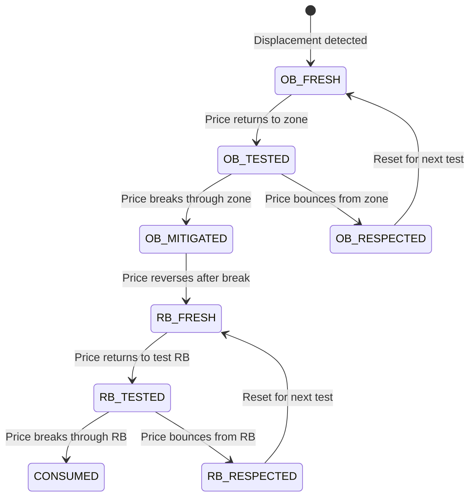
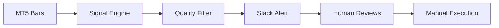
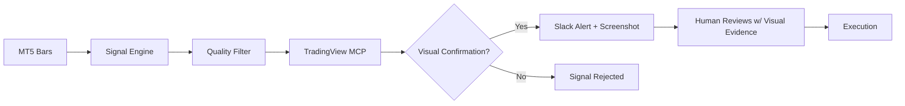
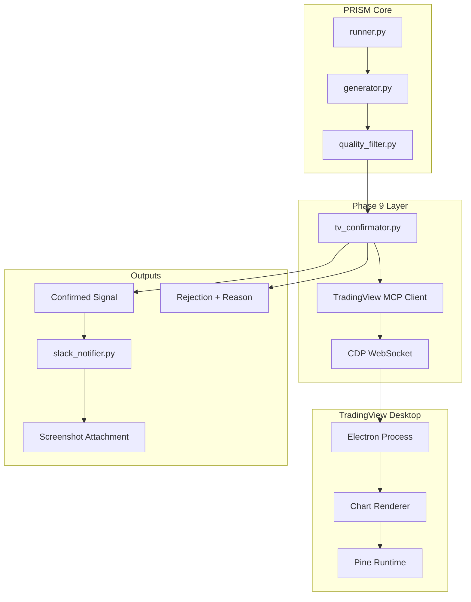

# PRD2 Appendix — Research Sources & AI-Native Vision

**Version:** 1.0
**Author:** Ada Sandpaw
**Date:** 2026-04-26
**Status:** RESEARCH
**Parent Document:** PRD2.md (Phases 5-8)

---

## Purpose

This appendix extends PRD2 with two research dimensions:

1. **Trader Research Corpus** — Five Instagram traders sourced by Brian as methodology mining targets for PRISM signal enhancement
2. **TradingView MCP Integration** — Phase 9 vision for AI-native visual confirmation using Claude Code + TradingView Desktop

These sources inform future PRISM development beyond PRD2's scope while maintaining alignment with the ICT/Smart Money foundation.

---

## Section 1: Trader Research Corpus

### Source Attribution

Traders sourced from Instagram reel by **@paidoffthemarket** (February 2026), titled "Real traders worth learning from." Brian flagged this reel as containing signal-dense accounts for ICT methodology extraction.

### Selection Criteria

- Active prop firm track record (payouts documented)
- ICT/Smart Money methodology signals in content
- Teachable patterns that map to PRISM algorithmic implementation
- Follower/engagement ratio indicating signal density

---

### 1.1 @barontrades — Baron

#### Profile

| Attribute | Value |
|-----------|-------|
| Followers | 28,000 |
| Experience | 5 years |
| Markets | Options & Futures |
| Documented Payouts | $500K+ (prop firms) |
| Content Categories | Payouts, Trades, Options profits, Testimonials |

#### ICT/Methodology Signals

Baron operates primarily in options and futures with significant prop firm capital. His content reveals patterns around:

- **Position sizing under drawdown limits** — Prop firms enforce strict daily/weekly drawdown caps (typically 5-10% of account). Baron's trade sizing adapts to remaining drawdown budget.
- **Options-derived delta hedging** — Stop placement influenced by options Greeks, particularly delta exposure at key strikes.
- **Multi-leg entry scaling** — Averaging into positions across 2-3 price levels rather than single-point entries.

#### Specific PRISM Features

| Feature | Description | Implementation Complexity |
|---------|-------------|---------------------------|
| Drawdown-aware lot sizing | Scale position size based on remaining daily drawdown budget | LOW — env var for daily max loss |
| Strike-level confluence | Mark options strikes as potential support/resistance | HIGH — requires TastyTrade API integration (`prism/data/options_feed.py`) |
| Scaled entry zones | Split FVG entry into 2-3 sub-entries at zone boundaries | LOW — modify entry price calculation |

#### Research Priority

**Priority: LOW**

**Justification:** Baron's methodology is options-heavy and diverges from PRISM's spot/futures focus. The drawdown-aware sizing is useful but already partially covered by `PRISM_MAX_DAILY_LOSS_PCT` (Phase 4 daily kill-switch, see `prism/delivery/drawdown_guard.py`). Strike-level confluence requires an options data feed not currently planned for PRISM.

---

### 1.2 @fearingtrades

#### Profile

| Attribute | Value |
|-----------|-------|
| Followers | 8,700 |
| Posts | 384 |
| Bio Methodology | "Po3 x QT" (Power of Three × Quantitative Tightening) |
| Prop Firm Coaching | Apex, MFFU, Alpha, TradeCopia |

#### ICT/Methodology Signals

**DIRECTLY RELEVANT TO PRISM.** @fearingtrades explicitly combines two concepts:

1. **Power of Three (Po3)** — The ICT framework PRISM already implements in Phase 6 (`po3.py`). His content shows refinements to phase detection, particularly:
   - Session-specific Po3 timing (London vs NY have different accumulation durations)
   - Po3 invalidation conditions (when manipulation fails to trigger distribution)
   - Multi-session Po3 carryover (London manipulation → NY distribution)

2. **QT Macro Filter** — Quantitative Tightening as a macro overlay. When the Fed is actively reducing its balance sheet (QT), risk assets exhibit different intraday patterns:
   - Reduced liquidity → sharper sweeps
   - Higher false breakout rate
   - Narrower kill zone windows

His prop firm coaching across 4 firms suggests methodology **may be** battle-tested across different account structures.

#### Specific PRISM Features

| Feature | Description | Implementation Complexity |
|---------|-------------|---------------------------|
| Po3 session timing | Different accumulation durations for London (45-60 min) vs NY (30-45 min) | LOW — parameterize `po3.py` |
| Po3 invalidation | Detect failed manipulation → skip distribution entry | MEDIUM — state machine extension |
| Po3 carryover | London manipulation carries to NY distribution | MEDIUM — cross-session state |
| QT macro filter | Fed balance sheet delta as daily bias modifier | HIGH — FRED API H.4.1 table (weekly) → `prism/data/macro.py` → daily cache → `htf_bias.py` integration |
| QT liquidity adjustment | Reduce sweep confirmation threshold during QT | LOW — conditional sweep params |

#### Research Priority

**Priority: HIGH**

**Justification:** Direct overlap with PRISM Phase 6 (Po3 detection). His methodology refinements address edge cases in the current `Po3Detector` implementation. The QT macro filter is novel and could become a Phase 10 feature. High prop firm exposure validates methodology robustness.

---

### 1.3 @nasdaqab — Anish

#### Profile

| Attribute | Value |
|-----------|-------|
| Followers | 12,000 |
| Bio | "Scaling traders to 5 figures+/mo" |
| Market Focus | Nasdaq (NQ) specialist |

#### ICT/Methodology Signals

Anish's content centers on **index-specific** adaptations of ICT concepts:

- **NY Open Precision** — Nasdaq has tighter entry windows than forex. His entries cluster within 15-30 minutes of NY open, not the full 2-hour kill zone PRISM currently uses.
- **Economic Calendar Gates** — Hard blocks around FOMC, CPI, NFP. Not just "increased volatility" but actual no-trade zones extending 30 min before and 90 min after.
- **NQ/ES Correlation** — Using ES (S&P 500 futures) divergence as a NQ entry confirmation. When NQ breaks structure but ES doesn't, it's a higher-probability trap.

#### Specific PRISM Features

| Feature | Description | Implementation Complexity |
|---------|-------------|---------------------------|
| Index kill zone tightening | NQ: 14:30-15:00 UTC instead of 14:00-16:00 UTC | LOW — instrument-specific config |
| Economic calendar gate | Hard no-trade blocks around major releases | MEDIUM — ForexFactory CSV export → `prism/data/calendar.py` → event-time blocking in `generator.py` |
| Cross-instrument divergence | ES/NQ divergence as confirmation layer | HIGH — requires second data feed |

#### Research Priority

**Priority: MEDIUM**

**Justification:** PRISM currently focuses on XAUUSD (gold). If PRISM expands to indices, Anish's methodology becomes directly applicable. The economic calendar gate is universally useful across all instruments and should be considered for Phase 10.

---

### 1.4 @jeron — Jeron McDonald

#### Profile

| Attribute | Value |
|-----------|-------|
| Followers | 8,000 |
| Bio | "$100K in payouts in past 60 days | Live Trading EVERY DAY" |
| Content Categories | PNL, Testimonials |
| Trading Style | High-velocity, daily session entries |

#### ICT/Methodology Signals

Jeron's content emphasizes **execution discipline** and **session consistency**:

- **Daily Session Entries** — Not swing trading. Entries happen every trading day during kill zones. This implies a methodology robust enough for daily signal generation.
- **High Payout Velocity** — $100K in 60 days suggests 10-15 funded accounts or **expected** high win rate on large accounts.
- **Testimonial Volume** — Students replicating results suggests teachable, systematic methodology.

Key observable patterns:

- **Session-entry precision** — Entries within first 15 minutes of kill zone, rarely mid-session
- **Small stop distances** — Visible SL levels are tight (10-15 pips on gold equivalent)
- **Single trade per session** — One high-conviction entry, no averaging

#### Specific PRISM Features

| Feature | Description | Implementation Complexity |
|---------|-------------|---------------------------|
| Kill zone front-loading | Prioritize signals in first 15 min of kill zone | LOW — time-based signal boost |
| Tight SL mode | Reduce SL to OB/FVG edge only (no ATR buffer) | LOW — SL calculation variant |
| Single-signal-per-session | Emit only highest-quality signal per kill zone | MEDIUM — rank by Phase 8 `fvg_quality_score` → emit top 1 per kill zone window |

#### Research Priority

**Priority: MEDIUM**

**Justification:** Jeron's methodology validates PRISM's kill zone approach but offers refinements around timing precision. The single-signal-per-session concept aligns with PRISM's quality-over-quantity Phase 8 direction. Worth deeper content analysis.

---

### 1.5 @powell.trades — Powell

#### Profile

| Attribute | Value |
|-----------|-------|
| Followers | 82,000 (LARGEST in corpus) |
| Posts | 21 |
| Bio | "Rejection block final boss" |
| Content Categories | Payouts, Students, Trades, Swings, Donations |
| Signal Density | 82K followers / 21 posts = 3,904 followers per post |

#### ICT/Methodology Signals

**DIRECTLY RELEVANT TO PRISM.** Powell's entire brand centers on **rejection blocks (RB)**, a concept PRISM Phase 6 must address:

**What is a Rejection Block?**

A rejection block is a **failed Order Block** that gets mitigated (price returns to and passes through it) but then **flips** to become a valid level from the opposite direction.

```
Bullish OB Forms → Price Returns → OB Gets Mitigated (broken) →
Price Reverses → Former OB is now Bearish Rejection Block
```

Powell's methodology:

1. **OB Mitigation Tracking** — Track when OBs get "used up" by price returning to them
2. **RB Classification** — Former bullish OB that gets mitigated becomes bearish RB
3. **RB Retest Entries** — Entry when price returns to test the RB from the new direction
4. **RB Hierarchy** — HTF RBs (4H, Daily) trump LTF RBs

The massive follower-to-post ratio (3,904:1) **may indicate** high signal density in his content. Each post likely contains significant methodology value.

#### Specific PRISM Features

| Feature | Description | Implementation Complexity |
|---------|-------------|---------------------------|
| OB mitigation state | Track OB lifecycle: FRESH → TESTED → MITIGATED | MEDIUM — state machine in `order_blocks.py` |
| RB detection | Identify mitigated OBs that flip direction | MEDIUM — extends OB detector |
| RB vs valid OB classification | Distinguish active OBs from RBs | LOW — boolean flag |
| Mitigation state machine | Full lifecycle: OB → Mitigated → RB → RB_Tested → Consumed (see Mermaid diagram below) | MEDIUM — state machine in `order_blocks.py` |
| HTF RB priority | 4H/Daily RBs override 1H RBs in signal generation | MEDIUM — hierarchy logic |

#### Mermaid: OB/RB Lifecycle



#### Research Priority

**Priority: HIGH**

**Justification:** Rejection blocks are a critical gap in PRISM Phase 6. The current `OrderBlockDetector` tracks OB creation but not lifecycle (mitigation → flip → RB). Powell's methodology directly addresses this gap. His follower count and signal density suggest proven, replicable patterns.

---

> ✅ **PHASE 6 GAP RESOLVED IN PRD2.md.** The original PRD2 v2.0 draft's `OrderBlockDetector` lacked OB mitigation tracking and rejection block classification — this would have blocked @powell.trades methodology integration. The canonical lifecycle state machine (FRESH → TESTED → RESPECTED → MITIGATED → RB_FRESH → RB_TESTED → RB_RESPECTED → CONSUMED) is now specified directly in `PRD2.md §Phase 6` with the full `OrderBlock` dataclass, `OrderBlockState` enum, `transition()` rules, and `htf_priority_filter()`. The Mermaid diagram below is preserved here for reference but the implementation truth lives in PRD2.md.

---

## Section 2: TradingView MCP Integration — Phase 9 Vision

### Source Attribution

- **Primary:** Instagram reel by @greymatter_ai (April 13, 2026) — "Claude Code can now see your TradingView charts"
- **Secondary:** Google Drive assets from Brian (architecture diagrams, installation notes)
- **GitHub:** tradesdontlie/tradingview-mcp (primary), atilaahmettaner/tradingview-mcp (OpenClaw fork)

---

### 2.1 What is TradingView MCP?

TradingView MCP (Model Context Protocol) is an integration layer that connects Claude Code to TradingView Desktop via Chrome DevTools Protocol.

#### Technical Stack

| Component | Technology |
|-----------|------------|
| Protocol | Chrome DevTools Protocol (CDP) |
| Transport | WebSocket (port 9222) |
| Target App | TradingView Desktop (Electron) |
| Runtime | Node.js 18+ |
| AI Integration | Claude Code MCP support |

#### Capabilities

| Capability | Method | Description |
|------------|--------|-------------|
| Chart Reading | `tv_screenshot` | Capture current chart as PNG |
| Bar Streaming | `tv_stream_values` | OHLCV via injected Pine Script indicators (requires Pine Runtime injection) |
| Indicator Values | `tv_data` | Read indicator outputs (RSI, MACD, custom) |
| Pine Script Injection | `tv_inject_script` | Compile and add indicators to chart |
| Drawing Tools | `tv_draw` | Add lines, zones, labels to chart |
| Symbol Navigation | `tv_set_symbol` | Change chart symbol/timeframe |

#### Requirements

| Requirement | Specification |
|-------------|---------------|
| TradingView Desktop | Paid subscription (Essential+) |
| Node.js | 18.0+ |
| Claude Code | MCP support enabled |
| OS | macOS, Windows, Linux |
| Network | localhost:9222 open |

---

### 2.2 The Gap TradingView MCP Fills

PRISM Phases 1-8 operate on **raw OHLCV bars** from MT5/Tiingo:

```
MT5 → Tiingo API → OHLCV DataFrame → Signal Engine → Slack Alert
```

A human trader **sees** the chart:
- FVG bodies rendered as gaps between candles
- OB candles highlighted by color
- Po3 phases visible as session structure
- Liquidity pools as swing high/low clusters

PRISM **computes** these algorithmically but without visual confirmation. The signal engine may correctly identify an FVG zone mathematically, but:

- Is it visually obvious on the chart?
- Does the human eye see the same structure?
- Are there conflicting visual patterns the algorithm missed?

**TradingView MCP lets PRISM SEE its own signals on the chart.**

#### Current Flow (Phases 1-8)



#### Proposed Flow (Phase 9)



---

### 2.3 Phase 9 Architecture

#### System Diagram



#### New Module: `prism/integration/tv_confirmator.py`

```python
"""
TradingView MCP Visual Confirmation Layer.
Phase 9: Confirms PRISM signals against rendered chart.
"""
from dataclasses import dataclass
from typing import Optional
import os

@dataclass
class TVConfirmationResult:
    confirmed: bool
    screenshot_path: Optional[str]
    fvg_visible: bool
    ob_visible: bool
    structure_match: bool
    rejection_reason: Optional[str]
    indicator_values: dict

class TVConfirmator:
    def __init__(self):
        self.enabled = os.environ.get("PRISM_TV_ENABLED", "0") == "1"
        self.host = os.environ.get("PRISM_TV_HOST", "localhost")
        self.port = int(os.environ.get("PRISM_TV_PORT", "9222"))
        self.screenshot_enabled = os.environ.get("PRISM_TV_SCREENSHOT", "1") == "1"
        self.symbol_prefix = os.environ.get("PRISM_TV_SYMBOL_PREFIX", "OANDA")
        self._client = None

    def connect(self) -> bool:
        """Establish CDP connection to TradingView Desktop."""
        pass

    def set_chart(self, instrument: str, timeframe: str) -> bool:
        """Navigate to instrument/timeframe."""
        pass

    def inject_prism_indicators(self) -> bool:
        """Inject PRISM Pine Script indicators for visual overlay."""
        pass

    def capture_screenshot(self) -> str:
        """Capture chart screenshot, return file path."""
        pass

    def read_indicator_values(self) -> dict:
        """
        Read PRISM indicator values from chart.

        ⚠️ TECHNICAL RISK: Requires parsing TradingView internal indicator state
        via CDP DOM traversal — may need screen-scraping fallback if Pine output
        not directly exposed.
        """
        pass

    def confirm_signal(
        self,
        instrument: str,
        timeframe: str,
        direction: str,
        fvg_zone: dict,
        ob_zone: Optional[dict],
        entry_price: float,
    ) -> TVConfirmationResult:
        """
        Full confirmation flow:
        1. Navigate to chart
        2. Inject PRISM indicators (if not already)
        3. Read indicator values
        4. Compare against signal parameters
        5. Capture screenshot
        6. Return confirmation result
        """
        pass
```

#### Pine Script Indicators for Injection

PRISM will inject its own indicators into TradingView for visual overlay:

| Indicator | Purpose | Pine Script |
|-----------|---------|-------------|
| PRISM_FVG | Highlight detected FVG zones | Box drawing at zone boundaries |
| PRISM_OB | Highlight Order Blocks | Colored candle background |
| PRISM_ENTRY | Mark signal entry level | Horizontal line with label |
| PRISM_SL_TP | Mark SL/TP levels | Dashed lines with R:R label |

Example Pine Script template:

```pine
//@version=5
indicator("PRISM FVG Overlay", overlay=true)

// Input from PRISM injection
fvg_high = input.float(0.0, "FVG High")
fvg_low = input.float(0.0, "FVG Low")
fvg_bar = input.int(0, "FVG Bar Index")

// Draw FVG zone
if fvg_high > 0 and fvg_low > 0
    box.new(fvg_bar, fvg_high, bar_index, fvg_low,
            bgcolor=color.new(color.purple, 80),
            border_color=color.purple)
```

---

### 2.4 Visual Confirmation Logic

#### Confirmation Checks

| Check | Method | Pass Condition |
|-------|--------|----------------|
| FVG Visible | Screenshot analysis | Gap visible between candles at zone |
| OB Candle Identified | Indicator value read | OB candle color matches direction |
| Structure Match | Bar data comparison | TV OHLCV matches PRISM computed values |
| Entry Level Valid | Drawing overlay | Entry price within current visible range |
| No Conflicting Patterns | Visual analysis | No opposing FVGs or OBs nearby |

#### Rejection Block Detection Enhancement

TradingView MCP enables **visual confirmation of OB mitigation** before classifying as rejection block:

```python
def confirm_rejection_block(self, ob_zone: dict) -> bool:
    """
    Visual confirmation that OB has been mitigated:
    1. Screenshot the OB zone timeframe
    2. Check if price has closed through the zone
    3. Confirm reversal candle after mitigation
    4. Return True if RB classification is valid
    """
    pass
```

---

### 2.5 Environment Variables (Phase 9)

| Variable | Default | Description |
|----------|---------|-------------|
| `PRISM_TV_ENABLED` | `0` | Enable TradingView MCP confirmation (default off) |
| `PRISM_TV_HOST` | `localhost` | CDP host address |
| `PRISM_TV_PORT` | `9222` | CDP port number |
| `PRISM_TV_SCREENSHOT` | `1` | Attach screenshots to Slack alerts |
| `PRISM_TV_SYMBOL_PREFIX` | `OANDA` | Broker prefix for TV symbols (OANDA:XAUUSD) |
| `PRISM_TV_INDICATOR_INJECT` | `1` | Auto-inject PRISM Pine indicators |
| `PRISM_TV_TIMEOUT_MS` | `5000` | CDP operation timeout |

---

### 2.6 Slack Integration Changes

#### New Screenshot Attachment

```
📸 Visual Confirmation
• Chart: OANDA:XAUUSD (H4)
• Screenshot attached below
• FVG Zone: ✅ Visible
• OB Zone: ✅ Visible
• Structure: ✅ Matches PRISM
```

Slack block format:

```python
{
    "type": "image",
    "title": {"type": "plain_text", "text": "PRISM Signal Chart"},
    "image_url": screenshot_url,  # Upload to Slack then embed
    "alt_text": "TradingView chart with PRISM overlays"
}
```

---

### 2.7 Integration Risks

| Risk | Severity | Mitigation |
|------|----------|------------|
| TradingView Desktop updates break CDP API | HIGH | Monitor TradingView release notes; test Phase 9 in staging environment before production updates; maintain fallback to manual chart review when TV MCP unavailable |
| CDP port blocked by firewall | MEDIUM | Document port 9222 requirement |
| Screenshot upload latency | LOW | Async upload, don't block signal |
| Pine Script injection fails | MEDIUM | Graceful fallback to confirmation without overlay |
| TV subscription expires | HIGH | Alert in Slack, disable TV layer |
| Rate limiting from TV | MEDIUM | Throttle to 1 confirmation per 30 seconds |

---

### 2.8 Test Estimate (Phase 9)

| Test Category | Count | Description |
|---------------|-------|-------------|
| Unit: TVConfirmator | 15 | Connection, navigation, injection, capture |
| Unit: Pine Injection | 5 | Indicator compilation, parameter passing |
| Integration: Full Flow | 10 | Signal → TV confirmation → Slack output |
| Mock: CDP Protocol | 8 | WebSocket message handling |
| E2E: Live TV Desktop | 5 | Requires actual TV Desktop running |
| **Total Phase 9** | **43** | |

---

### 2.9 OpenClaw Compatibility

For Hetzner deployment (OpenClaw infrastructure), use the forked version:

| Attribute | Value |
|-----------|-------|
| Repository | atilaahmettaner/tradingview-mcp |
| Compatibility | Hetzner VPS, headless mode via Xvfb |
| Additional Deps | xvfb, chromium-browser |
| Docker Support | Yes (Dockerfile included) |

Headless deployment requires:

```bash
# Start Xvfb virtual display
Xvfb :99 -screen 0 1920x1080x24 &
export DISPLAY=:99

# Launch TradingView Desktop
/opt/tradingview/TradingView --remote-debugging-port=9222
```

---

## Section 3: Research Priority Matrix

### Priority Ranking Table

| Source | Methodology Novelty | PRISM Alignment | Build Complexity | Overall Priority |
|--------|---------------------|-----------------|------------------|------------------|
| **@powell.trades** | HIGH — Rejection blocks are novel | HIGH — Extends Phase 6 OB detection | MEDIUM — State machine extension | **HIGH** |
| **@fearingtrades** | MEDIUM — Po3 refinements | HIGH — Direct Phase 6 overlap | LOW-MEDIUM — Parameter tuning | **HIGH** |
| **TradingView MCP** | HIGH — Visual confirmation layer | HIGH — Validates all phases | HIGH — New integration layer | **MEDIUM** (Deferred to Phase 9 — begins after PRD2 Phases 5-8 ship. Priority HIGH within Phase 9 work queue.) |
| **@nasdaqab** | MEDIUM — Index-specific patterns | MEDIUM — Instrument expansion | MEDIUM — New data feeds | **MEDIUM** |
| **@jeron** | LOW — Execution refinement | MEDIUM — Kill zone precision | LOW — Parameter tuning | **MEDIUM** |
| **@barontrades** | LOW — Options-focused | LOW — Different market type | HIGH — Options data feed | **LOW** |

### Recommended Research Order

1. **@powell.trades** — Immediate: RB detection fills Phase 6 gap
2. **@fearingtrades** — Immediate: Po3 refinements enhance Phase 6
3. **TradingView MCP** — Phase 9: Deferred to post-PRD2 (priority MEDIUM overall; HIGH within Phase 9 work queue)
4. **@nasdaqab** — Deferred: Index expansion scope
5. **@jeron** — Deferred: Minor optimization
6. **@barontrades** — Backlog: Different market focus

---

## Section 4: Next Steps

### Immediate Actions (Pre-Phase 9)

1. **Deep-dive @powell.trades content** — Extract RB detection rules for `order_blocks.py` enhancement
2. **Document @fearingtrades Po3 refinements** — Session-specific timing parameters
3. **Prototype economic calendar gate** — Universal feature from @nasdaqab methodology

### Phase 9 Preparation

1. **Install TradingView Desktop** on development machine
2. **Test CDP connection** manually before PRISM integration
3. **Draft Pine Script indicators** for FVG/OB overlay
4. **Design screenshot storage** (local vs S3 vs Slack-native)

### Long-Term Research

1. **QT Macro Filter** — Fed balance sheet API integration (@fearingtrades methodology)
2. **Multi-instrument support** — NQ/ES correlation layer (@nasdaqab methodology)
3. **Execution discipline scoring** — Trade consistency metrics (@jeron methodology)

---

## Appendix A: Instagram Account Links

| Handle | URL | Notes |
|--------|-----|-------|
| @paidoffthemarket | instagram.com/paidoffthemarket | Source reel |
| @barontrades | instagram.com/barontrades | Options focus |
| @fearingtrades | instagram.com/fearingtrades | Po3 x QT |
| @nasdaqab | instagram.com/nasdaqab | NQ specialist |
| @jeron | instagram.com/jeron | Daily entries |
| @powell.trades | instagram.com/powell.trades | Rejection blocks |
| @greymatter_ai | instagram.com/greymatter_ai | TV MCP source |

---

## Appendix B: TradingView MCP Repository Links

| Repository | Purpose | URL |
|------------|---------|-----|
| Primary | Original implementation | github.com/tradesdontlie/tradingview-mcp |
| OpenClaw Fork | Hetzner/headless compatible | github.com/atilaahmettaner/tradingview-mcp |

---

## Appendix C: Related PRD2 Phases

| This Appendix Topic | Related PRD2 Phase | Integration Point |
|---------------------|-------------------|-------------------|
| Rejection Blocks (@powell.trades) | Phase 6: order_blocks.py | OB lifecycle state machine |
| Po3 Refinements (@fearingtrades) | Phase 6: po3.py | Session timing parameters |
| Kill Zone Precision (@jeron, @nasdaqab) | Phase 6: generator.py | Time-based signal weighting |
| TradingView MCP | Phase 8: quality_filter.py output | Post-filter confirmation layer |

---

*End of PRD2 Appendix — Research Sources & AI-Native Vision*
